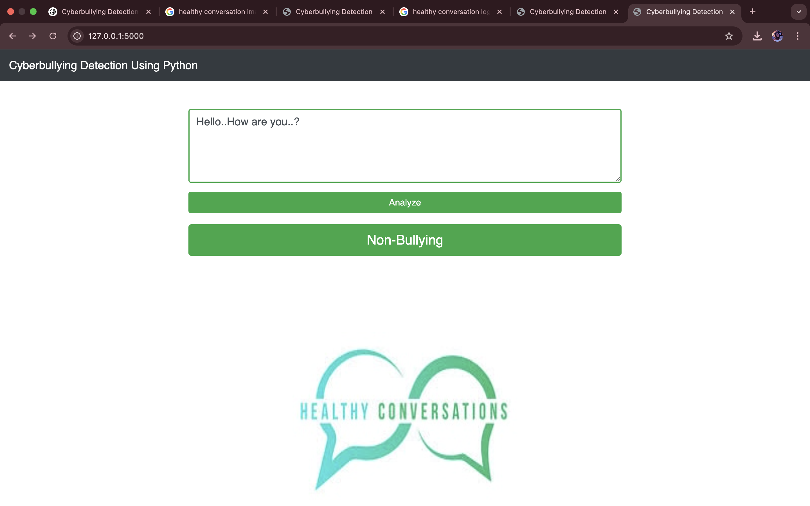
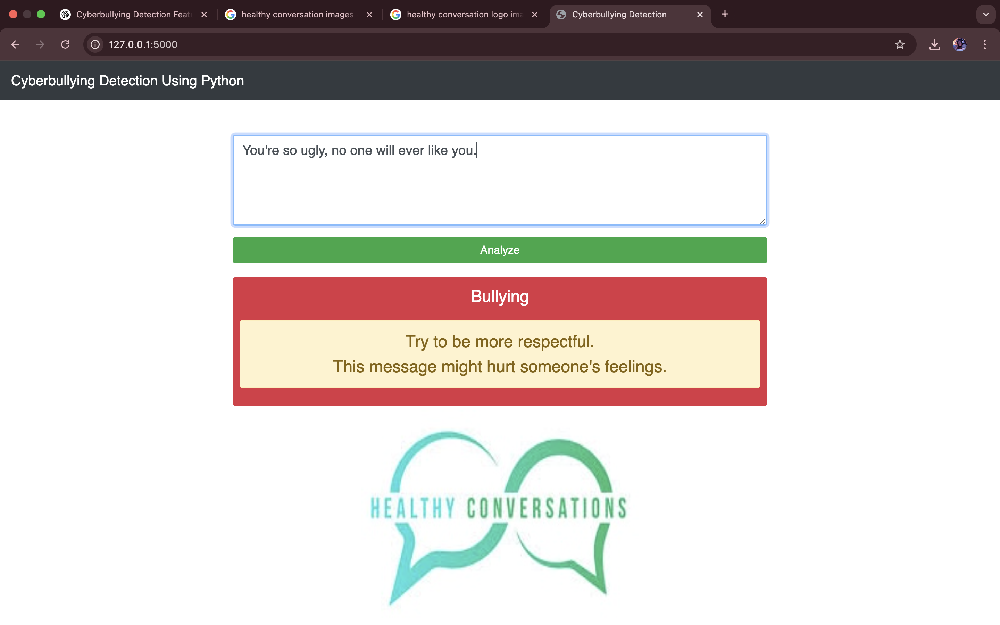

# Cyberbullying Detection Using Python & Machine Learning

This project is a web-based Cyberbullying Detection System built with Flask and powered by Machine Learning models. It takes a piece of text as input and classifies it as either "Bullying" or "Non-Bullying", helping in the identification of toxic or offensive language in online communications.

## Features

* Simple Web Interface (HTML + Bootstrap)
* Multiple ML models tested (Naive Bayes, SVM, XGBoost, etc.)
* Highest accuracy achieved using LinearSVC
* Text preprocessing using nltk, re, and TF-IDF
* Model performance visualized using matplotlib and seaborn
* Suggestions displayed when bullying content is detected
* Built using Python, Flask, HTML/CSS

## Use Case

- This project can be integrated into:
- Social Media Platforms: To filter or flag offensive user-generated content.
- Educational Platforms: For creating a safe online space for students.
- Comment Moderation Systems: Automatically flag bullying comments in forums, reviews, or live chats.

